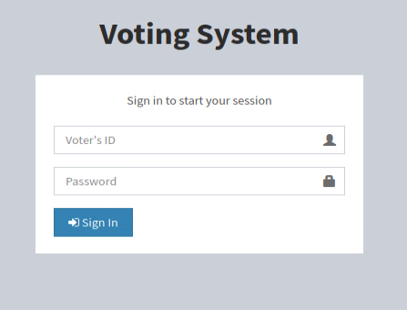
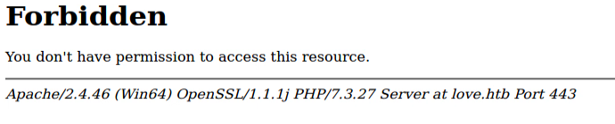
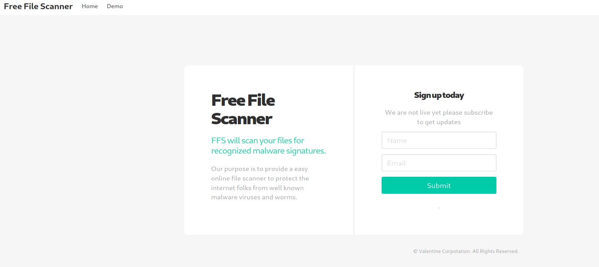
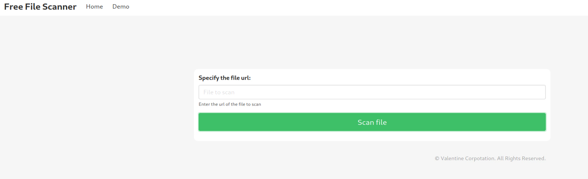
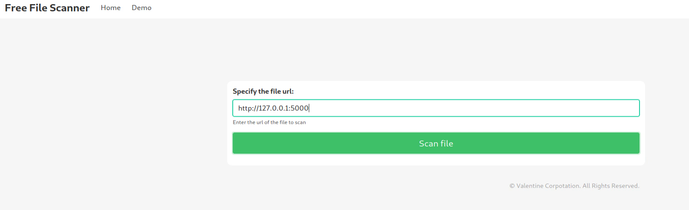
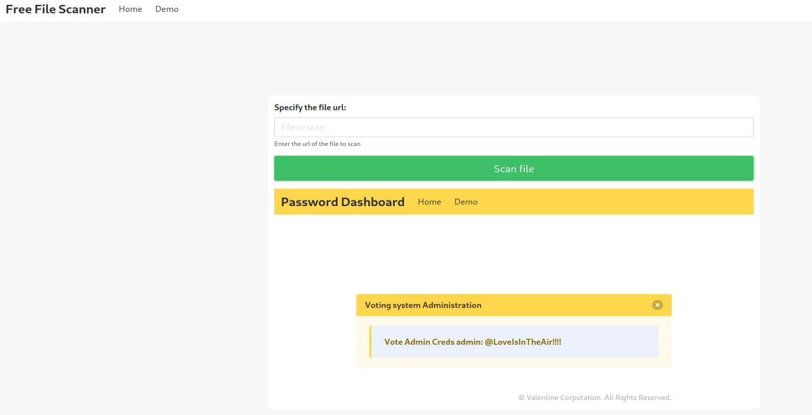
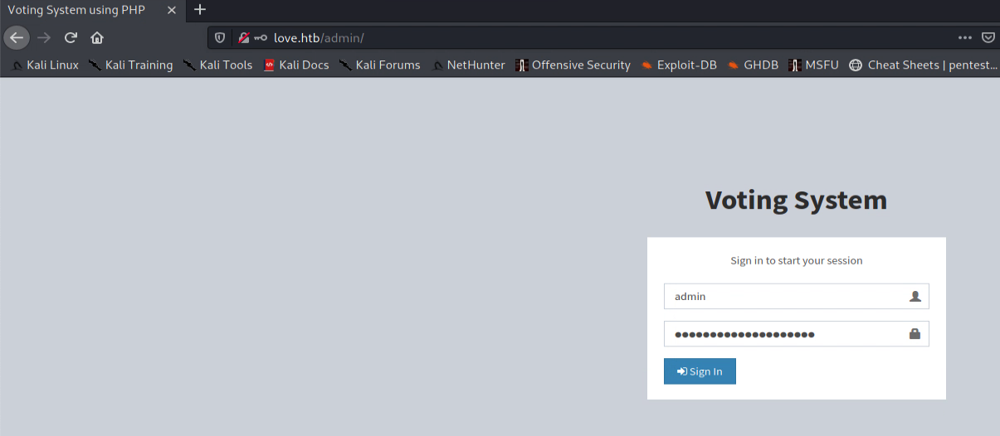
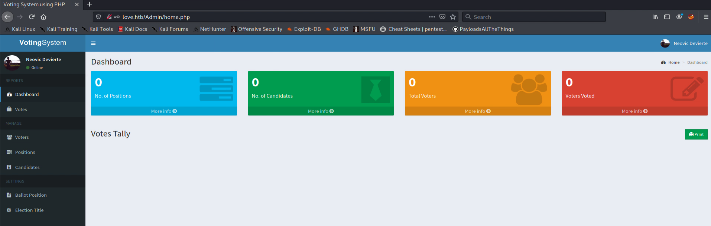

#Love - Easy Windows

##Enumeration

To start, run an nmap scan:

```bash
sudo nmap -T4 -p- -A 10.10.10.239 -oN scans/nmap-allports
# Nmap 7.91 scan initiated Sat Aug 14 21:28:46 2021 as: nmap -T4 -p- -A -oN scans/nmap-allports -vv 10.10.10.239
Nmap scan report for 10.10.10.239
Host is up, received echo-reply ttl 127 (0.011s latency).
Scanned at 2021-08-14 21:28:47 UTC for 218s
Not shown: 65516 closed ports
Reason: 65516 resets
PORT      STATE SERVICE      REASON          VERSION
80/tcp    open  http         syn-ack ttl 127 Apache httpd 2.4.46 ((Win64) OpenSSL/1.1.1j PHP/7.3.27)
| http-cookie-flags: 
|   /: 
|     PHPSESSID: 
|_      httponly flag not set
| http-methods: 
|_  Supported Methods: GET HEAD POST OPTIONS
|_http-server-header: Apache/2.4.46 (Win64) OpenSSL/1.1.1j PHP/7.3.27
|_http-title: Voting System using PHP
135/tcp   open  msrpc        syn-ack ttl 127 Microsoft Windows RPC
139/tcp   open  netbios-ssn  syn-ack ttl 127 Microsoft Windows netbios-ssn
443/tcp   open  ssl/http     syn-ack ttl 127 Apache httpd 2.4.46 (OpenSSL/1.1.1j PHP/7.3.27)
|_http-server-header: Apache/2.4.46 (Win64) OpenSSL/1.1.1j PHP/7.3.27
|_http-title: 403 Forbidden
| ssl-cert: Subject: commonName=staging.love.htb/organizationName=ValentineCorp/stateOrProvinceName=m/countryName=in/emailAddress=roy@love.htb/organizationalUnitName=love.htb/localityName=norway
| Issuer: commonName=staging.love.htb/organizationName=ValentineCorp/stateOrProvinceName=m/countryName=in/emailAddress=roy@love.htb/organizationalUnitName=love.htb/localityName=norway
| Public Key type: rsa
| Public Key bits: 2048
| Signature Algorithm: sha256WithRSAEncryption
| Not valid before: 2021-01-18T14:00:16
| Not valid after:  2022-01-18T14:00:16
| MD5:   bff0 1add 5048 afc8 b3cf 7140 6e68 5ff6
| SHA-1: 83ed 29c4 70f6 4036 a6f4 2d4d 4cf6 18a2 e9e4 96c2
| -----BEGIN CERTIFICATE-----
| MIIDozCCAosCFFhDHcnclWJmeuqOK/LQv3XDNEu4MA0GCSqGSIb3DQEBCwUAMIGN
| MQswCQYDVQQGEwJpbjEKMAgGA1UECAwBbTEPMA0GA1UEBwwGbm9yd2F5MRYwFAYD
| VQQKDA1WYWxlbnRpbmVDb3JwMREwDwYDVQQLDAhsb3ZlLmh0YjEZMBcGA1UEAwwQ
| c3RhZ2luZy5sb3ZlLmh0YjEbMBkGCSqGSIb3DQEJARYMcm95QGxvdmUuaHRiMB4X
| DTIxMDExODE0MDAxNloXDTIyMDExODE0MDAxNlowgY0xCzAJBgNVBAYTAmluMQow
| CAYDVQQIDAFtMQ8wDQYDVQQHDAZub3J3YXkxFjAUBgNVBAoMDVZhbGVudGluZUNv
| cnAxETAPBgNVBAsMCGxvdmUuaHRiMRkwFwYDVQQDDBBzdGFnaW5nLmxvdmUuaHRi
| MRswGQYJKoZIhvcNAQkBFgxyb3lAbG92ZS5odGIwggEiMA0GCSqGSIb3DQEBAQUA
| A4IBDwAwggEKAoIBAQDQlH1J/AwbEm2Hnh4Bizch08sUHlHg7vAMGEB14LPq9G20
| PL/6QmYxJOWBPjBWWywNYK3cPIFY8yUmYlLBiVI0piRfaSj7wTLW3GFSPhrpmfz0
| 0zJMKeyBOD0+1K9BxiUQNVyEnihsULZKLmZcF6LhOIhiONEL6mKKr2/mHLgfoR7U
| vM7OmmywdLRgLfXN2Cgpkv7ciEARU0phRq2p1s4W9Hn3XEU8iVqgfFXs/ZNyX3r8
| LtDiQUavwn2s+Hta0mslI0waTmyOsNrE4wgcdcF9kLK/9ttM1ugTJSQAQWbYo5LD
| 2bVw7JidPhX8mELviftIv5W1LguCb3uVb6ipfShxAgMBAAEwDQYJKoZIhvcNAQEL
| BQADggEBANB5x2U0QuQdc9niiW8XtGVqlUZOpmToxstBm4r0Djdqv/Z73I/qys0A
| y7crcy9dRO7M80Dnvj0ReGxoWN/95ZA4GSL8TUfIfXbonrCKFiXOOuS8jCzC9LWE
| nP4jUUlAOJv6uYDajoD3NfbhW8uBvopO+8nywbQdiffatKO35McSl7ukvIK+d7gz
| oool/rMp/fQ40A1nxVHeLPOexyB3YJIMAhm4NexfJ2TKxs10C+lJcuOxt7MhOk0h
| zSPL/pMbMouLTXnIsh4SdJEzEkNnuO69yQoN8XgjM7vHvZQIlzs1R5pk4WIgKHSZ
| 0drwvFE50xML9h2wrGh7L9/CSbhIhO8=
|_-----END CERTIFICATE-----
|_ssl-date: TLS randomness does not represent time
| tls-alpn: 
|_  http/1.1
445/tcp   open  microsoft-ds syn-ack ttl 127 Windows 10 Pro 19042 microsoft-ds (workgroup: WORKGROUP)
3306/tcp  open  mysql?       syn-ack ttl 127
| fingerprint-strings: 
|   Kerberos, NULL: 
|_    Host '10.10.14.200' is not allowed to connect to this MariaDB server
| mysql-info: 
|_  MySQL Error: Host '10.10.14.200' is not allowed to connect to this MariaDB server
5000/tcp  open  http         syn-ack ttl 127 Apache httpd 2.4.46 (OpenSSL/1.1.1j PHP/7.3.27)
|_http-server-header: Apache/2.4.46 (Win64) OpenSSL/1.1.1j PHP/7.3.27
|_http-title: 403 Forbidden
5040/tcp  open  unknown      syn-ack ttl 127
5985/tcp  open  http         syn-ack ttl 127 Microsoft HTTPAPI httpd 2.0 (SSDP/UPnP)
|_http-server-header: Microsoft-HTTPAPI/2.0
|_http-title: Not Found
5986/tcp  open  ssl/http     syn-ack ttl 127 Microsoft HTTPAPI httpd 2.0 (SSDP/UPnP)
|_http-server-header: Microsoft-HTTPAPI/2.0
|_http-title: Not Found
| ssl-cert: Subject: commonName=LOVE
| Subject Alternative Name: DNS:LOVE, DNS:Love
| Issuer: commonName=LOVE
| Public Key type: rsa
| Public Key bits: 4096
| Signature Algorithm: sha256WithRSAEncryption
| Not valid before: 2021-04-11T14:39:19
| Not valid after:  2024-04-10T14:39:19
| MD5:   d35a 2ba6 8ef4 7568 f99d d6f4 aaa2 03b5
| SHA-1: 84ef d922 a70a 6d9d 82b8 5bb3 d04f 066b 12f8 6e73
| -----BEGIN CERTIFICATE-----
| MIIFBTCCAu2gAwIBAgIQQD+VWjjYeaVAiweoWrOJXjANBgkqhkiG9w0BAQsFADAP
| MQ0wCwYDVQQDDARMT1ZFMB4XDTIxMDQxMTE0MzkxOVoXDTI0MDQxMDE0MzkxOVow
| DzENMAsGA1UEAwwETE9WRTCCAiIwDQYJKoZIhvcNAQEBBQADggIPADCCAgoCggIB
| APC54+VMM+g9yynvO9x5UWpskpl8oxYcplv/zck10LeamyoRMCoOb6+lPhokbydf
| 1cj/td1WjOoCkE22w8KBXt+GkBtYp1AuaiQuUWZbSU1TfKLgGTB+jqcn6L8oFdpm
| MMl1rdgW/dDLF4WRSgPd1bwSl1JrgM2ETbQNbuE+pPkUAOwQp9W2/YcSCPAc+a03
| bntUxAyVe/U4xm9GJYTliUGZCc4KY74ZhiIoE9N+qW9wH+THyTcKYFo6acCYK3OT
| NFxj2NVB34YSOaGwoJDfHOdt6q8hQSBk2MLcIlFMYpzyk6guxO6CYucufqPUhux8
| j8foDhPOQr4eg8L2WZq0mF2k0Owt+FPaFCQpq8Cuk3wxkrkHAlwzmxMjZUhO59Z7
| p7cSQt5JtDrSIghP9nePFkz1ARaUE4ifUfWb7ZhX5ZI2sWD7y5ilgK/+EJRUs8Qr
| aiNJQhr2W+Lu8Q8C821LrhQ8srRbV3APlj0jysYzTcerksSmA4L2NYEjdYuIkHNh
| VH7IUwAfyQCKhT9Z4l9TMmu0w84jvFV/e4PYrXe7W3jNquKI8+FvgAtj7crDkX6x
| ouN13d3Z12FsPFZB8S9cFhEnMUT0VcPqx4on6oD1+iD3dkPYi907kHjvHQqc43yZ
| vRSJBNy12LsX9bDyeew1jWBLqhdh0fApp+5LSKyEanENAgMBAAGjXTBbMA4GA1Ud
| DwEB/wQEAwIFoDATBgNVHSUEDDAKBggrBgEFBQcDATAVBgNVHREEDjAMggRMT1ZF
| ggRMb3ZlMB0GA1UdDgQWBBQNJyWWYTVg7yDEB8RiCpGkBlLzcjANBgkqhkiG9w0B
| AQsFAAOCAgEAOtD1tPlQAsAozmZxFGc7PiMkJpZbpS31Hb32/aFwTxeN/7VEmTPM
| +FyIo+ZxgL+GD6SGWtpunCGs2Hms3lbSxnPNPbdcaG6whP12Ih/xGuQEbXVq6uY3
| fmCL/zIHthIjDPbgvtrC0xB/1kioMrDdGK1jp1F9q1cd+9P3cTPXgpekTzcFixGF
| BkQTM0ty8FjZnwTYwtAJ7RcxbzhIGi4YlJGIBOi98XvParnR2co2XhR+gBBPhppC
| 0zKscOXtQrOyWymrq1XSEdFhExznQREXkGsUX9Ogw8yTdREt9jdlijjtQGISBlwG
| 807Ru8m6HeO35dhUp3fS1ZOQ94Zlmls8Uw4F0slQ5v44rhhbOziy3fcb63zSvFJ1
| jzk5yEoxER7tMiWrxCniGSI7kIs0ACGEWHbsbjfQuGVvTe2S/yBmUbCSuZPS9r1X
| w3EPapovLDMmx8PBLMXDa75bBE+si/3xS4w8OIepTrk+oajAWPjHSFrt6QRRI9Mv
| L1UEoxV1K7amnTybXb66kpvucZz0pQYVuRypOYLlFuFMC2vj8M/64Hfb5OhFG+6p
| RtFRdYl9s/H+R+Y+fB4o9Tf5vMpYwOCrBfTEGvm4JLBRGXn6f0ODcGqwVYVWyPEo
| 4pv8jZSiNJsmm6gsQXR4fLIPGuNjwmxJmm51Itv0Lb+FQogRk/9I0AI=
|_-----END CERTIFICATE-----
|_ssl-date: 2021-08-14T21:52:47+00:00; +20m23s from scanner time.
| tls-alpn: 
|_  http/1.1
7680/tcp  open  pando-pub?   syn-ack ttl 127
47001/tcp open  http         syn-ack ttl 127 Microsoft HTTPAPI httpd 2.0 (SSDP/UPnP)
|_http-server-header: Microsoft-HTTPAPI/2.0
|_http-title: Not Found
49664/tcp open  msrpc        syn-ack ttl 127 Microsoft Windows RPC
49665/tcp open  msrpc        syn-ack ttl 127 Microsoft Windows RPC
49666/tcp open  msrpc        syn-ack ttl 127 Microsoft Windows RPC
49667/tcp open  msrpc        syn-ack ttl 127 Microsoft Windows RPC
49668/tcp open  msrpc        syn-ack ttl 127 Microsoft Windows RPC
49669/tcp open  msrpc        syn-ack ttl 127 Microsoft Windows RPC
49670/tcp open  msrpc        syn-ack ttl 127 Microsoft Windows RPC
1 service unrecognized despite returning data. If you know the service/version, please submit the following fingerprint at https://nmap.org/cgi-bin/submit.cgi?new-service :
SF-Port3306-TCP:V=7.91%I=7%D=8/14%Time=611835B1%P=x86_64-pc-linux-gnu%r(NU
SF:LL,4B,"G\0\0\x01\xffj\x04Host\x20'10\.10\.14\.200'\x20is\x20not\x20allo
SF:wed\x20to\x20connect\x20to\x20this\x20MariaDB\x20server")%r(Kerberos,4B
SF:,"G\0\0\x01\xffj\x04Host\x20'10\.10\.14\.200'\x20is\x20not\x20allowed\x
SF:20to\x20connect\x20to\x20this\x20MariaDB\x20server");
No exact OS matches for host (If you know what OS is running on it, see https://nmap.org/submit/ ).
TCP/IP fingerprint:
OS:SCAN(V=7.91%E=4%D=8/14%OT=80%CT=1%CU=37457%PV=Y%DS=2%DC=T%G=Y%TM=6118366
OS:9%P=x86_64-pc-linux-gnu)SEQ(SP=102%GCD=1%ISR=108%TI=I%CI=I%II=I%SS=S%TS=
OS:U)OPS(O1=M54DNW8NNS%O2=M54DNW8NNS%O3=M54DNW8%O4=M54DNW8NNS%O5=M54DNW8NNS
OS:%O6=M54DNNS)WIN(W1=FFFF%W2=FFFF%W3=FFFF%W4=FFFF%W5=FFFF%W6=FF70)ECN(R=Y%
OS:DF=Y%T=80%W=FFFF%O=M54DNW8NNS%CC=N%Q=)T1(R=Y%DF=Y%T=80%S=O%A=S+%F=AS%RD=
OS:0%Q=)T2(R=Y%DF=Y%T=80%W=0%S=Z%A=S%F=AR%O=%RD=0%Q=)T3(R=Y%DF=Y%T=80%W=0%S
OS:=Z%A=O%F=AR%O=%RD=0%Q=)T4(R=Y%DF=Y%T=80%W=0%S=A%A=O%F=R%O=%RD=0%Q=)T5(R=
OS:Y%DF=Y%T=80%W=0%S=Z%A=S+%F=AR%O=%RD=0%Q=)T6(R=Y%DF=Y%T=80%W=0%S=A%A=O%F=
OS:R%O=%RD=0%Q=)T7(R=Y%DF=Y%T=80%W=0%S=Z%A=S+%F=AR%O=%RD=0%Q=)U1(R=Y%DF=N%T
OS:=80%IPL=164%UN=0%RIPL=G%RID=G%RIPCK=G%RUCK=G%RUD=G)IE(R=Y%DFI=N%T=80%CD=
OS:Z)

Network Distance: 2 hops
TCP Sequence Prediction: Difficulty=258 (Good luck!)
IP ID Sequence Generation: Incremental
Service Info: Hosts: www.example.com, LOVE, www.love.htb; OS: Windows; CPE: cpe:/o:microsoft:windows

Host script results:
|_clock-skew: mean: 2h05m23s, deviation: 3h30m02s, median: 20m22s
| p2p-conficker: 
|   Checking for Conficker.C or higher...
|   Check 1 (port 29716/tcp): CLEAN (Couldn't connect)
|   Check 2 (port 46453/tcp): CLEAN (Couldn't connect)
|   Check 3 (port 44577/udp): CLEAN (Failed to receive data)
|   Check 4 (port 21885/udp): CLEAN (Timeout)
|_  0/4 checks are positive: Host is CLEAN or ports are blocked
| smb-os-discovery: 
|   OS: Windows 10 Pro 19042 (Windows 10 Pro 6.3)
|   OS CPE: cpe:/o:microsoft:windows_10::-
|   Computer name: Love
|   NetBIOS computer name: LOVE\x00
|   Workgroup: WORKGROUP\x00
|_  System time: 2021-08-14T14:52:35-07:00
| smb-security-mode: 
|   account_used: guest
|   authentication_level: user
|   challenge_response: supported
|_  message_signing: disabled (dangerous, but default)
| smb2-security-mode: 
|   2.02: 
|_    Message signing enabled but not required
| smb2-time: 
|   date: 2021-08-14T21:52:34
|_  start_date: N/A

TRACEROUTE (using port 1720/tcp)
HOP RTT      ADDRESS
1   11.96 ms 10.10.14.1
2   12.05 ms 10.10.10.239

Read data files from: /usr/bin/../share/nmap
OS and Service detection performed. Please report any incorrect results at https://nmap.org/submit/ .
# Nmap done at Sat Aug 14 21:32:25 2021 -- 1 IP address (1 host up) scanned in 218.81 seconds
```
Looking at the certificate on port 443, we see a domain name:
```ssl-cert: Subject: commonName=staging.love.htb/organizationName=ValentineCorp/stateOrProvinceName=m/countryName=in/emailAddress=roy@love.htb/organizationalUnitName=love.htb/localityName=norway```

Add this subdomain and the love domain name to our ```/etc/hosts```

```
sudo vi /etc/hosts
...
10.10.10.239		love.htb staging.love.htb
...
```
Running a quick dirbister scan on ```love.htb``` we find an admin page

```dirb http://love.htb

-----------------
DIRB v2.22    
By The Dark Raver
-----------------

START_TIME: Sat Aug 14 21:46:51 2021
URL_BASE: http://love.htb/
WORDLIST_FILES: /usr/share/dirb/wordlists/common.txt

-----------------

GENERATED WORDS: 4612                                                          

---- Scanning URL: http://love.htb/ ----
==> DIRECTORY: http://love.htb/admin/                                                                                                                                                                                                        
==> DIRECTORY: http://love.htb/Admin/                                                                                                                                                                                                        
==> DIRECTORY: http://love.htb/ADMIN/                                                                                                                                                                                                        
+ http://love.htb/aux (CODE:403|SIZE:298)                                                                                                                                                                                                    
+ http://love.htb/cgi-bin/ (CODE:403|SIZE:298)                                                                                                                                                                                               
+ http://love.htb/com1 (CODE:403|SIZE:298)                                                                                                                                                                                                   
+ http://love.htb/com2 (CODE:403|SIZE:298)                                                                                                                                                                                                   
+ http://love.htb/com3 (CODE:403|SIZE:298)                                                                                                                                                                                                   
+ http://love.htb/con (CODE:403|SIZE:298)                                                                                                                                                                                                    
==> DIRECTORY: http://love.htb/dist/                                                                                                                                                                                                         
+ http://love.htb/examples (CODE:503|SIZE:398)                                                                                                                                                                                               
==> DIRECTORY: http://love.htb/images/                                                                                                                                                                                                       
==> DIRECTORY: http://love.htb/Images/                                                                                                                                                                                                       
==> DIRECTORY: http://love.htb/includes/                                                                                                                                                                                                     
+ http://love.htb/index.php (CODE:200|SIZE:4388)                                                                                                                                                                                             
+ http://love.htb/licenses (CODE:403|SIZE:417)                                                                                                                                                                                               
+ http://love.htb/lpt1 (CODE:403|SIZE:298)                                                                                                                                                                                                   
+ http://love.htb/lpt2 (CODE:403|SIZE:298)                                                                                                                                                                                                   
+ http://love.htb/nul (CODE:403|SIZE:298)                                                                                                                                                                                                    
+ http://love.htb/phpmyadmin (CODE:403|SIZE:298)                                                                                                                                                                                             
==> DIRECTORY: http://love.htb/plugins/                                                                                                                                                                                                      
+ http://love.htb/prn (CODE:403|SIZE:298)                                                                                                                                                                                                    
+ http://love.htb/server-info (CODE:403|SIZE:417)                                                                                                                                                                                            
+ http://love.htb/server-status (CODE:403|SIZE:417)                                                                                                                                                                                          
+ http://love.htb/webalizer (CODE:403|SIZE:298)                                                                                                                                                                                              
                                                                                                                                                                                                                                             
---- Entering directory: http://love.htb/admin/ ----
+ http://love.htb/admin/aux (CODE:403|SIZE:298)                                                                                                                                                                                              
+ http://love.htb/admin/com1 (CODE:403|SIZE:298)                                                                                                                                                                                             
+ http://love.htb/admin/com2 (CODE:403|SIZE:298)                                                                                                                                                                                             
+ http://love.htb/admin/com3 (CODE:403|SIZE:298)                                                                                                                                                                                             
+ http://love.htb/admin/con (CODE:403|SIZE:298)                                                                                                                                                                                              
==> DIRECTORY: http://love.htb/admin/includes/                                                                                                                                                                                               
+ http://love.htb/admin/index.php (CODE:200|SIZE:6198)                                                                                                                                                                                       
+ http://love.htb/admin/lpt1 (CODE:403|SIZE:298)                                                                                                                                                                                             
+ http://love.htb/admin/lpt2 (CODE:403|SIZE:298)                                                                                                                                                                                             
+ http://love.htb/admin/nul (CODE:403|SIZE:298)                                                                                                                                                                                              
+ http://love.htb/admin/prn (CODE:403|SIZE:298)                                                                                                                                                                                              
                                                                                                                                                                                                                                             
---- Entering directory: http://love.htb/Admin/ ----
+ http://love.htb/Admin/aux (CODE:403|SIZE:298)                                                                                                                                                                                              
+ http://love.htb/Admin/com1 (CODE:403|SIZE:298)                                                                                                                                                                                             
+ http://love.htb/Admin/com2 (CODE:403|SIZE:298)                                                                                                                                                                                             
+ http://love.htb/Admin/com3 (CODE:403|SIZE:298)                                                                                                                                                                                             
+ http://love.htb/Admin/con (CODE:403|SIZE:298)                                                                                                                                                                                              
==> DIRECTORY: http://love.htb/Admin/includes/                                                                                                                                                                                               
+ http://love.htb/Admin/index.php (CODE:200|SIZE:6198)                                                                                                                                                                                       
+ http://love.htb/Admin/lpt1 (CODE:403|SIZE:298)                                                                                                                                                                                             
+ http://love.htb/Admin/lpt2 (CODE:403|SIZE:298)                                                                                                                                                                                             
+ http://love.htb/Admin/nul (CODE:403|SIZE:298)                                                                                                                                                                                              
+ http://love.htb/Admin/prn (CODE:403|SIZE:298)                                                                                                                                                                                              
                                                                                                                                                                                                                                             
---- Entering directory: http://love.htb/ADMIN/ ----
+ http://love.htb/ADMIN/aux (CODE:403|SIZE:298)                                                                                                                                                                                              
+ http://love.htb/ADMIN/com1 (CODE:403|SIZE:298)                                                                                                                                                                                             
+ http://love.htb/ADMIN/com2 (CODE:403|SIZE:298)                                                                                                                                                                                             
+ http://love.htb/ADMIN/com3 (CODE:403|SIZE:298)                                                                                                                                                                                             
+ http://love.htb/ADMIN/con (CODE:403|SIZE:298)                                                                                                                                                                                              
==> DIRECTORY: http://love.htb/ADMIN/includes/                                                                                                                                                                                               
+ http://love.htb/ADMIN/index.php (CODE:200|SIZE:6198)                                                                                                                                                                                       
+ http://love.htb/ADMIN/lpt1 (CODE:403|SIZE:298)                                                                                                                                                                                             
+ http://love.htb/ADMIN/lpt2 (CODE:403|SIZE:298)                                                                                                                                                                                             
+ http://love.htb/ADMIN/nul (CODE:403|SIZE:298)                                                                                                                                                                                              
+ http://love.htb/ADMIN/prn (CODE:403|SIZE:298)                                                                                                                                                                                              
                                                                                                                                                                                                                                             
---- Entering directory: http://love.htb/dist/ ----
(!) WARNING: Directory IS LISTABLE. No need to scan it.                        
    (Use mode '-w' if you want to scan it anyway)
                                                                                                                                                                                                                                             
---- Entering directory: http://love.htb/images/ ----
(!) WARNING: Directory IS LISTABLE. No need to scan it.                        
    (Use mode '-w' if you want to scan it anyway)
                                                                                                                                                                                                                                             
---- Entering directory: http://love.htb/Images/ ----
(!) WARNING: Directory IS LISTABLE. No need to scan it.                        
    (Use mode '-w' if you want to scan it anyway)
                                                                                                                                                                                                                                             
---- Entering directory: http://love.htb/includes/ ----
(!) WARNING: Directory IS LISTABLE. No need to scan it.                        
    (Use mode '-w' if you want to scan it anyway)
                                                                                                                                                                                                                                             
---- Entering directory: http://love.htb/plugins/ ----
(!) WARNING: Directory IS LISTABLE. No need to scan it.                        
    (Use mode '-w' if you want to scan it anyway)
                                                                                                                                                                                                                                             
---- Entering directory: http://love.htb/admin/includes/ ----
(!) WARNING: Directory IS LISTABLE. No need to scan it.                        
    (Use mode '-w' if you want to scan it anyway)
                                                                                                                                                                                                                                             
---- Entering directory: http://love.htb/Admin/includes/ ----
(!) WARNING: Directory IS LISTABLE. No need to scan it.                        
    (Use mode '-w' if you want to scan it anyway)
                                                                                                                                                                                                                                             
---- Entering directory: http://love.htb/ADMIN/includes/ ----
(!) WARNING: Directory IS LISTABLE. No need to scan it.                        
    (Use mode '-w' if you want to scan it anyway)
                                                                               
-----------------
END_TIME: Sat Aug 14 21:51:10 2021
DOWNLOADED: 18448 - FOUND: 47
```

##Web Investigation
nmap gave us three ports with apache server listening on. These were 80, 443 and 5000

Checking out these sites

HTTP gives us a login screen



HTTPS gives a forbidden message



As does port 5000

Looking at the subdirectory ```staging.love.htb```

Gives us a file scanner page which is not yet live



There is a demo site which accepts a file url



As we couldn't access port 5000 from out attacking machine, let's try and access it as locahost from this page





BINGO!! We have some credentials. Let's try them on the admin page we found through dirbuster





We have logged onto the admin dashboard. Time to see what we can do

